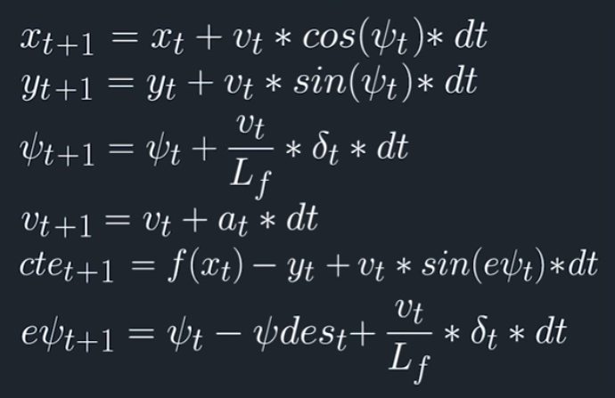

# CarND-Controls-MPC
Self-Driving Car Engineer Nanodegree Program

---

## Introduction

The goal of this project is to create a Model Predictive Controller to drive a vehicle around a track on Udacity's simulator. The simulator provides the desired trajectory and current state of the vehicle, then it expects back commands for both steering and accelerator/brake pedal.

As a high overview of the workflow, we use the trajectory provided by the simulator to fit a third degree polynomial and we pass this and the current state to the MPC. Then, the MPC calculates the optimum trajectory based on a vehicle model and some other constrains (e.g maximum steering angle). The optimum trajectory is based on cost function which we try to minimise, this cost function penalises deviations from the desired trajectory in terms of distance and orientation. Additionally, to make the drive smoother, we penalise also heavy actuator use.


## Implementation

 1.  **Vehicle Model:**
	 
The vehicle model,  based on the vehicle's current state (position, orientation and speed) and actuator position (acceleration and steering angle), predicts the state at the next timestep. The model not only predicts the vehicles position orientation and speed but also the cross-track and orientation error. These are used in the cost function.

The model equations as explained in the lessons are:


 
 2. **Timestep Number and Duration (N & dt):** 
 
As the MPC calculates a new trajectory every 100 milliseconds, predicting the optimum trajectory for all the waypoints would be a waste of resources. Also, the kinematic model is quite simple and will accumulate error for a long prediction horizon. 

For this reason we only calculate for a few timesteps of predefined duration. The starting project suggested 10 timesteps of 0.1 seconds. After some tuning, I achieved my best results with 10 timesteps of 0.065 seconds. The reasoning behind these values is that the prediction horizon seems to be enough, and the timestep length fits with the latency and calculation time of my setup (0.1s latency + 0.03s optimization = 2*0.065s).
 
 3. Waypoints Preprocessing and Polynomial Fitting:
 
To simplify the polynomial fitting and further calculations, we preprocess the waypoints received from the simulator and we transform them to a different coordinate system where the vehicle is the origin. This way both coordinates x, y and the orientation are 0 at the first timestep. 
 
 4. Latency Handling:
 
One of the challenges of the project is to handle the latency present between command and actuation. To simulate this, a fixed delay of 100ms is introduced. We receive the data from the simulator at time t, we finish calculation of the command at t+30ms (average calculation time) and the simulator receives the command at t+130ms. 

To handle this delay we could predict the future state using the model equations before sending it to the MPC, but this would lead to code duplication. A cleaner way of handling it, is via constrains in the optimisation problem, in my case, I fixed the values of the actuators for the two first timesteps to the previous commanded value.
 
 5. Bonus: Reference Speed Update:
 
To achieved a more realistic driving I wanted the car to brake before the corners. I tried to use the cost function penalise speed based on the orientation, but this will make the vehicle to brake in the middle of the corner, which is undesirable in real life. 

As an alternative, I used the fitted the polynomial to compare the orientation of two points of the desired trajectory, and made the target speed linearly proportional to the orientation difference between this two points. The two points are further ahead of the prediction horizon so that the car brakes before entering the corner. This is a very simple solution, but does the job quite well.

## Dependencies

* cmake >= 3.5
 * All OSes: [click here for installation instructions](https://cmake.org/install/)
* make >= 4.1
  * Linux: make is installed by default on most Linux distros
  * Mac: [install Xcode command line tools to get make](https://developer.apple.com/xcode/features/)
  * Windows: [Click here for installation instructions](http://gnuwin32.sourceforge.net/packages/make.htm)
* gcc/g++ >= 5.4
  * Linux: gcc / g++ is installed by default on most Linux distros
  * Mac: same deal as make - [install Xcode command line tools]((https://developer.apple.com/xcode/features/)
  * Windows: recommend using [MinGW](http://www.mingw.org/)
* [uWebSockets](https://github.com/uWebSockets/uWebSockets)
  * Run either `install-mac.sh` or `install-ubuntu.sh`.
  * If you install from source, checkout to commit `e94b6e1`, i.e.
    ```
    git clone https://github.com/uWebSockets/uWebSockets 
    cd uWebSockets
    git checkout e94b6e1
    ```
    Some function signatures have changed in v0.14.x. See [this PR](https://github.com/udacity/CarND-MPC-Project/pull/3) for more details.
* Fortran Compiler
  * Mac: `brew install gcc` (might not be required)
  * Linux: `sudo apt-get install gfortran`. Additionall you have also have to install gcc and g++, `sudo apt-get install gcc g++`. Look in [this Dockerfile](https://github.com/udacity/CarND-MPC-Quizzes/blob/master/Dockerfile) for more info.
* [Ipopt](https://projects.coin-or.org/Ipopt)
  * Mac: `brew install ipopt`
       +  Some Mac users have experienced the following error:
       ```
       Listening to port 4567
       Connected!!!
       mpc(4561,0x7ffff1eed3c0) malloc: *** error for object 0x7f911e007600: incorrect checksum for freed object
       - object was probably modified after being freed.
       *** set a breakpoint in malloc_error_break to debug
       ```
       This error has been resolved by updrading ipopt with
       ```brew upgrade ipopt --with-openblas```
       per this [forum post](https://discussions.udacity.com/t/incorrect-checksum-for-freed-object/313433/19).
  * Linux
    * You will need a version of Ipopt 3.12.1 or higher. The version available through `apt-get` is 3.11.x. If you can get that version to work great but if not there's a script `install_ipopt.sh` that will install Ipopt. You just need to download the source from the Ipopt [releases page](https://www.coin-or.org/download/source/Ipopt/) or the [Github releases](https://github.com/coin-or/Ipopt/releases) page.
    * Then call `install_ipopt.sh` with the source directory as the first argument, ex: `sudo bash install_ipopt.sh Ipopt-3.12.1`. 
  * Windows: TODO. If you can use the Linux subsystem and follow the Linux instructions.
* [CppAD](https://www.coin-or.org/CppAD/)
  * Mac: `brew install cppad`
  * Linux `sudo apt-get install cppad` or equivalent.
  * Windows: TODO. If you can use the Linux subsystem and follow the Linux instructions.
* [Eigen](http://eigen.tuxfamily.org/index.php?title=Main_Page). This is already part of the repo so you shouldn't have to worry about it.
* Simulator. You can download these from the [releases tab](https://github.com/udacity/self-driving-car-sim/releases).
* Not a dependency but read the [DATA.md](./DATA.md) for a description of the data sent back from the simulator.


## Basic Build Instructions


1. Clone this repo.
2. Make a build directory: `mkdir build && cd build`
3. Compile: `cmake .. && make`
4. Run it: `./mpc`.

## Tips

1. It's recommended to test the MPC on basic examples to see if your implementation behaves as desired. One possible example
is the vehicle starting offset of a straight line (reference). If the MPC implementation is correct, after some number of timesteps
(not too many) it should find and track the reference line.
2. The `lake_track_waypoints.csv` file has the waypoints of the lake track. You could use this to fit polynomials and points and see of how well your model tracks curve. NOTE: This file might be not completely in sync with the simulator so your solution should NOT depend on it.
3. For visualization this C++ [matplotlib wrapper](https://github.com/lava/matplotlib-cpp) could be helpful.

## Editor Settings

We've purposefully kept editor configuration files out of this repo in order to
keep it as simple and environment agnostic as possible. However, we recommend
using the following settings:

* indent using spaces
* set tab width to 2 spaces (keeps the matrices in source code aligned)

## Code Style

Please (do your best to) stick to [Google's C++ style guide](https://google.github.io/styleguide/cppguide.html).

## Project Instructions and Rubric

Note: regardless of the changes you make, your project must be buildable using
cmake and make!

More information is only accessible by people who are already enrolled in Term 2
of CarND. If you are enrolled, see [the project page](https://classroom.udacity.com/nanodegrees/nd013/parts/40f38239-66b6-46ec-ae68-03afd8a601c8/modules/f1820894-8322-4bb3-81aa-b26b3c6dcbaf/lessons/b1ff3be0-c904-438e-aad3-2b5379f0e0c3/concepts/1a2255a0-e23c-44cf-8d41-39b8a3c8264a)
for instructions and the project rubric.

## Hints!

* You don't have to follow this directory structure, but if you do, your work
  will span all of the .cpp files here. Keep an eye out for TODOs.

## Call for IDE Profiles Pull Requests

Help your fellow students!

We decided to create Makefiles with cmake to keep this project as platform
agnostic as possible. Similarly, we omitted IDE profiles in order to we ensure
that students don't feel pressured to use one IDE or another.

However! I'd love to help people get up and running with their IDEs of choice.
If you've created a profile for an IDE that you think other students would
appreciate, we'd love to have you add the requisite profile files and
instructions to ide_profiles/. For example if you wanted to add a VS Code
profile, you'd add:

* /ide_profiles/vscode/.vscode
* /ide_profiles/vscode/README.md

The README should explain what the profile does, how to take advantage of it,
and how to install it.

Frankly, I've never been involved in a project with multiple IDE profiles
before. I believe the best way to handle this would be to keep them out of the
repo root to avoid clutter. My expectation is that most profiles will include
instructions to copy files to a new location to get picked up by the IDE, but
that's just a guess.

One last note here: regardless of the IDE used, every submitted project must
still be compilable with cmake and make./
